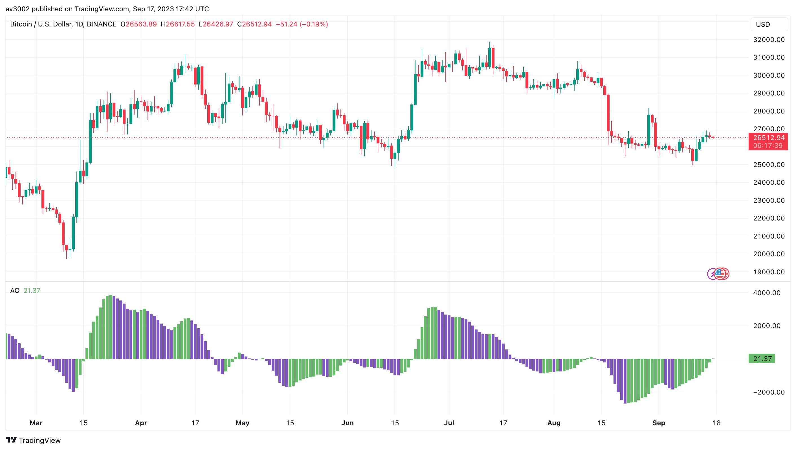
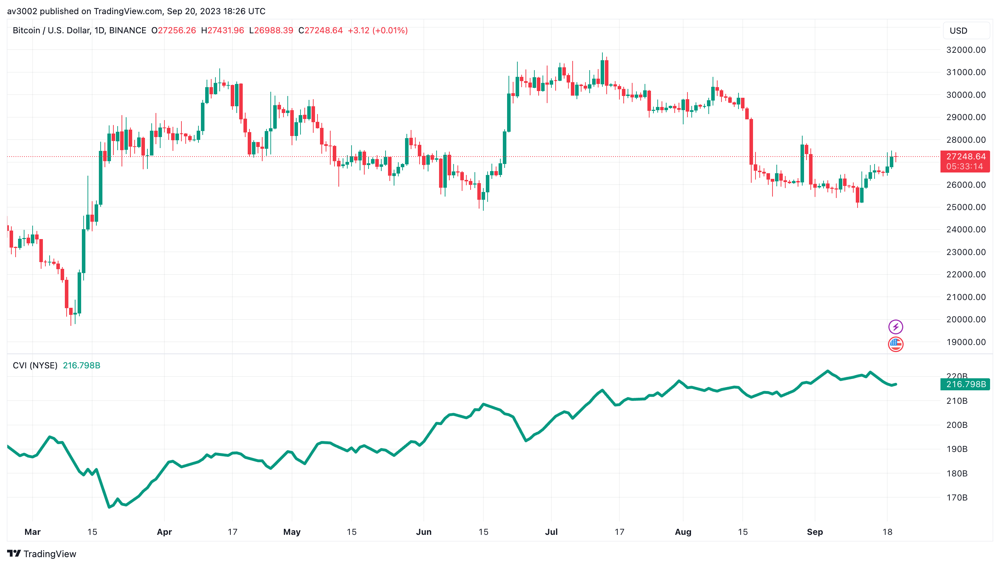
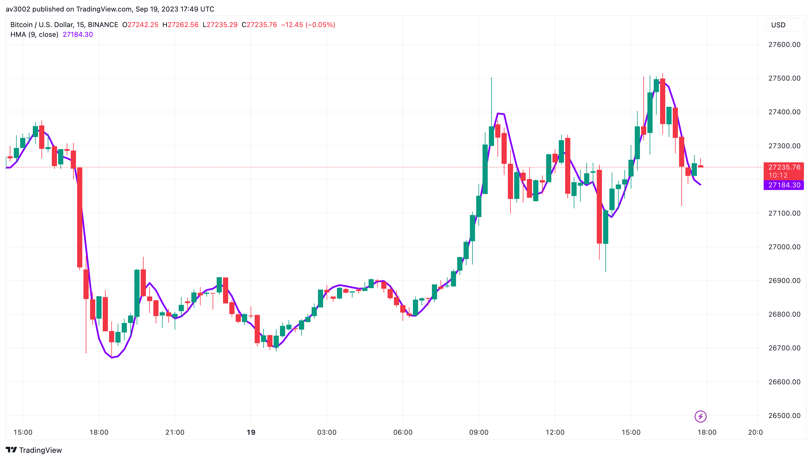
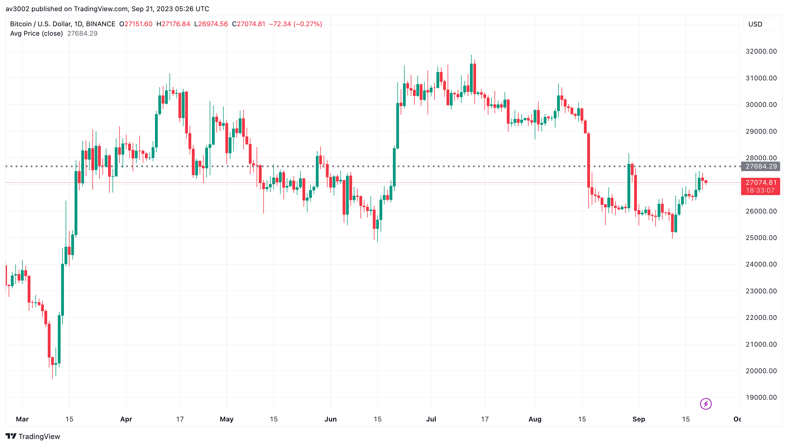

  <h1>📈 Custom Strategy Indicators V2</h1>
  
Technical indicators are essential in 📈 stock market analysis and trading. They provide insights into price trends, momentum, and market sentiment, guiding informed decision-making. Proficiency in these indicators is vital for success in the dynamic and competitive financial markets.

## 📈 Indicators Included

The following indicators are included in this repository:

- 🌟 Awesome Oscillator
- 📈 Cumulative Volume Index
- 🚀 Hull Moving Average
- 🌙 Moon Phases
- 📊 Visible Average Price

## 📋 Indicator Descriptions

### Awesome Oscillator 🌟

The Awesome Oscillator is a momentum indicator that helps traders identify the strength of a trend by comparing the 5-period simple moving average (SMA) and the 34-period SMA. It consists of bars that change color to reflect bullish or bearish momentum.

#### Use Case 📈
- Use the Awesome Oscillator to confirm the strength of a trend.
- Combine it with other indicators to identify potential entry and exit points in a trade.

#### How to Use 📋
1. **Installation**: Add the Awesome Oscillator indicator to your preferred trading platform (e.g., TradingView).
2. **Configuration**: Customize the indicator settings, such as period lengths, to match your trading strategy.
3. **Interpretation**: When the Awesome Oscillator bars change from red to green, it indicates a potential bullish trend, and vice versa.

### Cumulative Volume Index 📈

The Cumulative Volume Index (CVI) is a volume-based indicator that measures the cumulative total of volume on up days minus the cumulative total of volume on down days. It provides insights into the flow of money in and out of a security, helping traders gauge market sentiment.

#### Use Case 📈
- Apply the Cumulative Volume Index to identify divergences between price trends and volume, which can signal potential reversals.
- Monitor CVI changes to gauge investor sentiment.

#### How to Use 📋
1. **Installation**: Add the Cumulative Volume Index indicator to your trading platform.
2. **Interpretation**: Observe how CVI moves in conjunction with price movements. Divergences may indicate trend reversals.

### Hull Moving Average 🚀

The Hull Moving Average (HMA) is a responsive moving average that reduces lag while smoothing out price data. It achieves this by using weighted moving averages of different timeframes, making it more sensitive to recent price changes.

#### Use Case 📈
- Utilize the Hull Moving Average to identify trending markets with reduced lag.
- Combine it with other indicators to confirm trend direction.

#### How to Use 📋
1. **Installation**: Add the Hull Moving Average indicator to your trading platform.
2. **Configuration**: Adjust the HMA's period and smoothing options to align with your trading strategy.
3. **Interpretation**: Look for crossovers between the HMA and price to identify potential entry and exit signals.

### Moon Phases 🌙

Moon Phases is a unique indicator that overlays moon phase information on a trading chart. Some traders believe that lunar phases can influence market behavior and sentiment, making this indicator a tool for unconventional analysis.

#### Use Case 📈
- Apply Moon Phases to explore unconventional factors that may influence market sentiment.
- Use it in conjunction with traditional indicators for a holistic analysis.

#### How to Use 📋
1. **Installation**: Add the Moon Phases indicator to your trading platform.
2. **Interpretation**: Observe how market behavior aligns with lunar phases. Look for patterns or correlations.

### Visible Average Price 📊

The Visible Average Price (VAP) indicator displays a horizontal histogram on the chart, representing the volume profile at different price levels. It helps traders identify areas of significant buying or selling interest.

#### Use Case 📈
- Use the Visible Average Price to identify key support and resistance levels based on volume profiles.
- Combine it with traditional price-based analysis for a comprehensive view.

#### How to Use 📋
1. **Installation**: Add the Visible Average Price indicator to your trading platform.
2. **Configuration**: Adjust the VAP settings to match your preferred timeframes.
3. **Interpretation**: Look for areas where the VAP histogram is concentrated, as they indicate significant price levels.

## 🚀 Usage and Instructions

To use these indicators:
1. Open the TradingView Pine Script editor.
2. Copy the Pine Script code of the desired indicator from this repository.
3. Paste the code in the Pine Script editor.
4. Customize the indicator's parameters as needed.
5. Apply the indicator to your chart to visualize its signals.

Feel free to explore, modify, and integrate these indicators into your trading strategies. Happy trading!